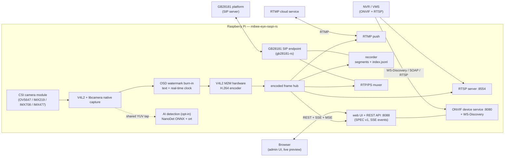
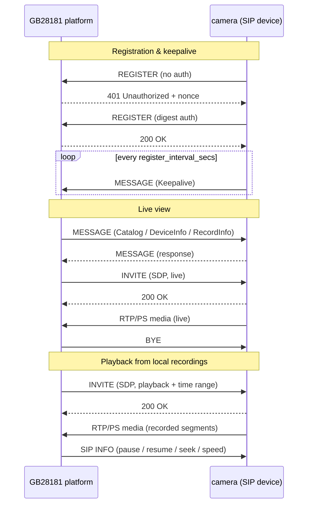

# MiBee Eye (蜂眼) — Rust

[](LICENSE)
[](https://rustup.rs)

[中文文档](README_zh.md)

ONVIF camera service for Raspberry Pi — **Rust rewrite** of
[mibee-eye-raspi-go](https://github.com/xiqing85/mibee-eye-raspi-go).

Captures H.264 video with native V4L2/libcamera (zero subprocesses), streams
via RTSP/RTMP, speaks ONVIF Profile S and GB28181 for NVR integration, records
continuously with playback support, and can run on-device NanoDet object
detection.

> **Why Rust?** The Go version relied on `mtxrpicam` (subprocess pipe) for
> camera capture and `ffmpeg` for HLS transcoding. This Rust rewrite uses
> native V4L2 and libcamera bindings, eliminating all subprocess dependencies
> for a leaner, more reliable deployment on resource-constrained SBCs.

---

## Features

| Feature | Status | Description |
|---------|--------|-------------|
| **ONVIF Profile S** | ✅ | Device/Media/Imaging SOAP server + WS-Discovery (port 8080) |
| **RTSP Streaming** | ✅ | H.264 video streaming (port 8554) |
| **GB28181 Device** | ✅ | SIP registration (UDP/TCP), Catalog/DeviceInfo/RecordInfo queries, live/playback/download PS streaming, SIP INFO playback control, platform snapshot commands — powered by [gb28181-rs](https://github.com/mickeyzzc/gb28181-rs) |
| **GB 35114 A-level** | ✅ | Optional SM2 certificate REGISTER auth + keyed-SM3 integrity (`--features gb35114`) |
| **Web Management UI** | ✅ | Embedded SPEC v1 admin panel: live preview, config, events (port 8088) |
| **Local Recording** | ✅ | Continuous H.264 segments + `index.jsonl`, retention & storage cap (GB28181 playback source) |
| **RTMP Push** | ✅ | Push the stream to cloud RTMP services |
| **AI Detection** | ✅ | NanoDet-Plus ONNX object detection on shared pre-encode frames — `--features ai`, see [docs/features/ai-detection.md](docs/features/ai-detection.md) |
| **OSD Watermark** | ✅ | Custom text + real-time clock burned into every output (RTSP/RTMP/recordings/GB28181) |
| **Snapshot** | ✅ | JPEG capture via HTTP GET |
| **Image Controls** | ✅ | Brightness, contrast, saturation, sharpness |
| **Motion Detection** | 🚧 | Frame-delta detector implemented (`src/motion/`) but not yet wired into the web API |
| **Multi-Camera** | 🚧 | Reserved — see [docs/features/multi-camera.md](docs/features/multi-camera.md) |
| **WebRTC** | 🚧 | Reserved — see [docs/features/webrtc.md](docs/features/webrtc.md) |
| **H.265/HEVC** | 🚧 | Reserved — see [docs/features/h265.md](docs/features/h265.md) |

---

## Architecture



Single capture pipeline fans out to every consumer: the watermark is burned
pre-encode so RTSP, RTMP, recordings, GB28181 PS streams and the web preview
all carry it; AI detection taps the shared pre-encode YUV so inference never
touches the capture or encoding path.

### GB28181 interaction overview



### Performance vs the Go version

| Metric | Go (v1) | Rust (v2) | Improvement |
|--------|---------|-----------|-------------|
| Binary Size | ~15 MB | ~2 MB | **87% smaller** |
| Memory Usage | 15–25 MB (+15 MB for ffmpeg) | 6–12 MB | **~50% reduction** |
| Subprocess Dependencies | mtxrpicam + ffmpeg | None | **Zero subprocesses** |
| CPU Usage (720p@15fps) | ~15% | ~10% | **~33% reduction** |
| Cross-compile | Zero CGO | musl static | **Fully static binary** |

---

## Quick Start

### Native Build

```bash
git clone https://github.com/xiqing85/mibee-eye-raspi-rs.git
cd mibee-eye-raspi-rs
cargo build --release
```

### Cross-compile for ARM64 (RPi)

```bash
# Option 1: rust-lld (fully static, no external tools — recommended)
rustup target add aarch64-unknown-linux-musl
make cross-build

# Option 2: Zig
cargo install cargo-zigbuild
make cross-build-zig

# Option 3: Docker cross
cargo install cross
make cross-build-cross

# Option 4: Native GCC toolchain
make cross-build-native
```

The AI feature builds with `make cross-build` too (`--features ai`); the
resulting binary loads `libonnxruntime.so` at runtime (see
[docs/features/ai-detection.md](docs/features/ai-detection.md)).

### Deploy to Raspberry Pi

```bash
# Quick install (after cross-build)
./deploy/install.sh pi@192.168.1.100

# Or manually via Makefile
make deploy-cross REMOTE_HOST=pi@192.168.1.100
```

See the [deployment guide on mibeecam docs](https://www.mlsbs.top/docs/mibeecam)
for detailed deployment instructions.

---

## Configuration

Copy and edit the example config:

```bash
cp config.example.toml config.toml
# Edit for your camera and network
```

Key settings:

| Section | Key | Default | Description |
|---------|-----|---------|-------------|
| `[camera]` | `device` | `/dev/video0` | V4L2 camera device |
| `[camera]` | `mode` | `"mtxrpicam"` | Capture mode: `mtxrpicam` or `rtsp` |
| `[camera]` | `width` / `height` | 1280×720 | Capture resolution |
| `[camera]` | `fps` | 15 | Frames per second |
| `[camera]` | `bitrate` | 2000000 | Target bitrate (bps) |
| `[rtsp]` | `port` | 8554 | RTSP server port |
| `[rtmp]` | `enabled` / `url` | `false` / — | Push the stream to an RTMP server |
| `[onvif]` | `port` | 8080 | ONVIF SOAP/HTTP port |
| `[onvif]` | `password` | — | ONVIF authentication (set this!) |
| `[web]` | `port` | 8088 | Web admin UI port (credentials mirror ONVIF by default) |
| `[gb28181]` | `enabled` | `false` | SIP platform registration (`transport`: udp/tcp) |
| `[recording]` | `enabled` | `false` | Continuous H.264 segments (600s / 3-day retention / 8192MB cap) |
| `[storage.local]` | `path` / `retention_days` | — | Recording directory and retention |
| `[watermark]` | `enabled` / `text` | `false` / — | OSD watermark: text + RTC, position, font size, font path |
| `[features.ai]` | `enabled` | `false` | NanoDet detection: model, confidence, interval, memory/core guardrails |
| `[motion]` | `enabled` | `false` | Motion detection (not yet wired to the web API) |

Environment variables with the `MIBEE_EYE_` prefix override any file setting:

```bash
MIBEE_EYE_ONVIF_PASSWORD=secret ./mibee-eye-raspi-rs
```

Full reference: [config.example.toml](config.example.toml)

---

## Web API (SPEC v1)

The embedded web UI on `:8088` is served by a JSON REST API shared across the
MiBee camera projects. Responses use the `{"ok":true,"data":…}` /
`{"ok":false,"error","message"}` envelope; authentication is cookie-session
with double-submit CSRF; capabilities are negotiated so clients only render
what the device supports.

| Endpoint | Description |
|----------|-------------|
| `POST /api/auth/login` · `/api/auth/logout` · `GET /api/auth/session` | Cookie session + CSRF token |
| `GET /api/cameras` | Camera resource model (single-camera device: `id="0"`) |
| `GET /api/config` · `PUT /api/config` | Read config; partial-merge write (absent sections untouched) |
| `GET /api/detections` | Latest AI detections (`{"enabled":false}` when the AI feature is off) |
| `GET /api/ai/models` · `POST /api/ai/models/{id}/activate` | Model registry & runtime switch (feature `ai`) |
| `GET /api/events` | SSE event channel (`ai_detection`, config changes, …) |
| `GET /snapshot` | JPEG snapshot |

All AI failures are fail-open: a missing model or ONNX runtime degrades to
`ai:false` capability — never fabricated detections.

---

## ONVIF Integration

The ONVIF server implements **Profile S** (Device, Media, Imaging) SOAP
services over HTTP, powered by [onvif-device-rs](https://github.com/mickeyzzc/onvif-rs).
It is designed to integrate with:

- **MiBee NVR** — automatic discovery via WS-Discovery on the local network
- **Synology Surveillance Station** — add camera manually via ONVIF endpoint
- **Blue Iris** — ONVIF camera integration
- **Scrypted** — HomeKit Secure Video bridge
- **Any ONVIF-compatible NVR/VMS**

### WS-Discovery

The service announces itself via WS-Discovery multicast probes. NVRs
auto-discover the camera without manual configuration.

### Endpoint

```
http://<camera-ip>:8080/onvif/device_service
```

### Media Profile

| Parameter | Value |
|-----------|-------|
| Video Codec | H.264 (Baseline/Main/High) |
| Resolution | 640×480 to 2592×1944 |
| Framerate | Up to 30 fps |
| Bitrate | Configurable (default 2 Mbps) |
| RTSP Endpoint | `rtsp://<ip>:8554/stream` |

---

## Hardware Support

### Raspberry Pi

| Model | Camera Interface | Notes |
|-------|------------------|-------|
| **RPi 3B** | CSI (V4L2) | Recommended: OV5647 camera module |
| **RPi 4** | CSI (V4L2) | Higher throughput for 1080p |
| **RPi 5** | CSI (V4L2) | Best performance, dual CSI |

### Camera Modules

| Module | Sensor | Max Resolution | Focus | Notes |
|--------|--------|----------------|-------|-------|
| Pi Camera V1 | OV5647 | 2592×1944 | Fixed | Production-tested |
| Pi Camera V2 | IMX219 | 3280×2464 | Fixed | Better low-light |
| Pi Camera V3 | IMX708 | 4608×2592 | Autofocus | PDAF, HDR |
| Pi HQ Camera | IMX477 | 4056×3040 | Manual | Interchangeable lens |
| USB/UVC | Various | Various | Various | `/dev/video*` |

### Resource Requirements

| Model | Memory | Storage | Network |
|-------|--------|---------|---------|
| RPi 3B | 1 GB | 8 GB SD + USB disk | 100 Mbps |
| RPi 4 | 2-8 GB | 16 GB+ SD | 1 Gbps |
| RPi 5 | 4-8 GB | 16 GB+ SD | 1 Gbps |

---

## Reserved Features

These features are designed but not yet implemented. Enabling them in config
logs a warning and gracefully degrades.

| Feature | Doc | Status |
|---------|-----|--------|
| Multi-Camera | [docs/features/multi-camera.md](docs/features/multi-camera.md) | 🚧 |
| WebRTC | [docs/features/webrtc.md](docs/features/webrtc.md) | 🚧 |
| H.265/HEVC | [docs/features/h265.md](docs/features/h265.md) | 🚧 |

---

## Development

### Prerequisites

- **Rust** 1.83+ (install via `rustup`)
- **V4L2** development headers (for native builds)
  - Debian: `sudo apt install libv4l-dev`
  - Arch: `sudo pacman -S v4l-utils`

### Commands

```bash
# Build
cargo build --release

# Test
cargo test

# Lint
cargo clippy -- -D warnings

# Format check
cargo fmt --check

# Run locally
cargo run --release
```

### Feature Flags

```bash
# V4L2 hardware encoder (H.264) — enabled by default
cargo build --release --features "v4l2-encoder"

# AI detection (NanoDet + ONNX Runtime, loaded dynamically)
cargo build --release --features "ai"

# GB 35114 A-level security (SM2 cert auth + keyed-SM3 integrity)
cargo build --release --features "gb35114"

# Reserved features (for development)
cargo build --release --features "multi-camera,webrtc,h265"
```

---

## License

CC BY-NC 4.0（非商业性使用，禁止商用）— see [LICENSE](LICENSE). MediaMTX-derived
portions and the bundled Noto font keep their own licenses (see
[NOTICE](NOTICE)).
