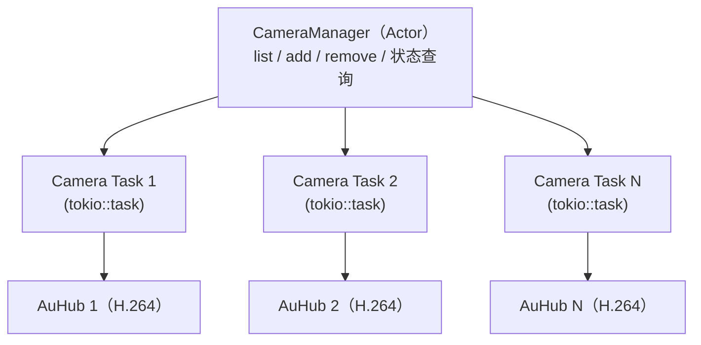

# 多摄像头支持功能设计文档

> **状态：规划中，未实现**。配置 `[features.multi_camera] enabled = true`
> 仅记录告警并优雅降级。本文为设计文档，非实现文档。

## 设计意图 (Design Intent)

多摄像头支持功能旨在让 mibee-eye-raspi-rs 能够同时管理多路 ONVIF 摄像头的视频流，实现全方位、多角度的监控覆盖。当前的单摄像头设计限制了系统的扩展性，无法满足家庭、办公室、工厂等需要多视角监控的场景。

通过引入多摄像头架构，系统可以：
- 支持同时连接多个 ONVIF 摄像头（不同 IP）
- 为每个摄像头独立的录制和流媒体输出
- 统一管理所有摄像头（列表、添加、删除、状态查询）
- 灵活分配系统资源（CPU、存储、网络带宽）

**核心应用场景：**
- 家庭安防（前门、后院、室内多个摄像头）
- 办公楼监控（大厅、走廊、会议室）
- 工厂生产线（多个工位、设备）
- 零售店铺（入口、货架、收银台）

## 未来方向与技术选型 (Future Direction & Tech Stack)

### 技术路线

多摄像头支持将采用基于 tokio 的并发架构，每个摄像头作为独立的异步任务运行，共享中央调度器和资源池。

#### 并发模型



#### 架构设计

**共享组件：**
- **CameraManager**：中央管理器（Actor 模式），处理 CRUD 操作
- **资源池**：共享的编码器、存储、网络资源
- **状态存储**：内存中维护摄像头列表（或 SQLite 持久化）

**独立组件（每个摄像头）：**
- **Camera Task**：独立的 tokio 任务，处理该摄像头的所有操作
- **AuHub**：独立的视频处理单元（捕获、编码、流媒体）
- **状态机**：该摄像头独立的生命周期（初始化、运行、暂停、停止）

### 技术选型

| 组件 | 技术栈 | 说明 |
|------|--------|------|
| **并发** | tokio 1.x | 异步运行时，支持多任务并发 |
| **Actor** | tokio::sync::mpc 或 async-channel | 用于 CameraManager 的消息传递 |
| **持久化** | SQLite (rusqlite) | 存储摄像头配置（名称、URL、认证） |
| **锁机制** | tokio::sync::RwLock | 保护共享状态（摄像头列表） |
| **监控** | Prometheus metrics + tokio-metrics | 每个摄像头的性能指标 |

### Cargo 依赖（未来）

```toml
[dependencies]
# 已有
tokio = { version = "1", features = ["full"] }

# 新增
rusqlite = { version = "0.31", features = ["bundled"] }
async-channel = "2.1"
tracing = "0.1"

# 监控（可选）
prometheus = { version = "0.13", optional = true }
tokio-metrics = { version = "0.3", optional = true }

[features]
default = []
metrics = ["dep:prometheus", "dep:tokio-metrics"]
```

### 配置示例（未来）

```toml
# 未来配置，当前未实现
[multi_camera]
enabled = true
max_cameras = 8
default_storage_path = "/var/lib/mibee-eye/recordings"

[[camera]]
id = "cam-001"
name = "前门监控"
url = "rtsp://192.168.1.100:554/stream1"
username = "admin"
password = "password"
enabled = true
recording_enabled = true
streaming_enabled = true

[[camera]]
id = "cam-002"
name = "后院监控"
url = "rtsp://192.168.1.101:554/stream1"
username = "admin"
password = "password"
enabled = true
recording_enabled = true
streaming_enabled = false  # 仅录制，不流媒体
```

## 硬件门控逻辑 (Hardware Gating Logic)

多摄像头支持对硬件要求相对宽松，主要受 CPU、存储和网络带宽限制。没有专门的硬件编码器要求（已有 H.264 硬件编码器即可复用）。

### 必需硬件

| 硬件规格 | 最低要求 | 推荐配置 | 说明 |
|---------|---------|---------|------|
| **CPU** | ARMv8 (4核) | ARM Cortex-A72+ | 多核可提升并发处理能力 |
| **RAM** | ≥ 2GB | ≥ 4GB | 每个摄像头任务约需 50-100MB |
| **存储** | ≥ 32GB | ≥ 128GB SSD | 多路录制需要更大存储空间 |

### 网络带宽要求

| 摄像头数量 | 单路码率 | 总带宽要求 | 备注 |
|-----------|---------|-----------|------|
| **2 路** | 2 Mbps | 4 Mbps | Pi 3B 上限 |
| **4 路** | 2 Mbps | 8 Mbps | Pi 4 可支持 |
| **8 路** | 2 Mbps | 16 Mbps | Pi 5 可支持 |

### 设备兼容性矩阵

| 设备 | 最大摄像头数 | 推荐数量 | 说明 |
|------|------------|---------|------|
| **Pi 3B (1GB)** | 2 路 | 1-2 路 | CPU 和内存受限 |
| **Pi 4 (4GB)** | 6 路 | 3-4 路 | 性能较好，可支持多路 |
| **Pi 5 (8GB)** | 12 路 | 6-8 路 | 性能强劲，可支持更多 |

### 检测逻辑

基于 `src/hardware/capability.rs` 的检测：

```rust
// 未来 API，当前未实现
pub struct MultiCameraCapabilityGate {
    cpu_cores: u8,
    memory_mb: u64,
    max_cameras: u8,
}

impl MultiCameraCapabilityGate {
    pub fn max_supported_cameras(&self) -> u8 {
        let cpu_limit = self.cpu_cores as u8;
        let memory_limit = (self.memory_mb / 512) as u8; // 每摄像头 512MB
        cpu_limit.min(memory_limit).min(self.max_cameras)
    }

    pub fn recommended_cameras(&self) -> u8 {
        self.max_supported_cameras() / 2  // 保守估计，留有余量
    }
}
```

## 接口契约 (Interface Contract)

### 核心 Trait 定义

```rust
// 未来 API，当前未实现
use async_trait::async_trait;

/// 摄像头信息
#[derive(Debug, Clone)]
pub struct CameraInfo {
    pub id: String,        // 摄像头唯一标识
    pub name: String,      // 显示名称
    pub status: String,    // 状态（"running", "stopped", "error"）
}

/// 摄像头配置
#[derive(Debug, Clone)]
pub struct CameraConfig {
    pub name: String,           // 摄像头名称
    pub url: String,            // ONVIF/RTSP URL
    pub username: Option<String>, // 认证用户名
    pub password: Option<String>, // 认证密码
}

/// 多摄像头管理器 Trait
#[async_trait]
pub trait CameraManager: Send + Sync {
    /// 列出所有注册的摄像头
    ///
    /// # 返回
    /// - `Ok(Vec<CameraInfo>)`: 摄像头信息列表
    /// - `Err(FeatureError)`: 查询失败
    async fn list_cameras(&self) -> Result<Vec<CameraInfo>, FeatureError>;

    /// 注册新摄像头并返回分配的 ID
    ///
    /// # 参数
    /// - `config`: 摄像头配置
    ///
    /// # 返回
    /// - `Ok(String)`: 分配的摄像头 ID
    /// - `Err(FeatureError)`: 添加失败（如 URL 无效、已达到上限）
    async fn add_camera(&self, config: CameraConfig) -> Result<String, FeatureError>;

    /// 删除指定 ID 的摄像头
    ///
    /// # 参数
    /// - `id`: 摄像头 ID
    ///
    /// # 返回
    /// - `Ok(())`: 删除成功
    /// - `Err(FeatureError)`: 删除失败（如 ID 不存在、摄像头正在运行）
    async fn remove_camera(&self, id: &str) -> Result<(), FeatureError>;
}
```

### 扩展接口（未来）

```rust
// 未来 API，当前未实现
pub trait CameraManagerExt: CameraManager {
    /// 启动指定摄像头
    async fn start_camera(&self, id: &str) -> Result<(), FeatureError>;

    /// 停止指定摄像头
    async fn stop_camera(&self, id: &str) -> Result<(), FeatureError>;

    /// 获取摄像头详细信息
    async fn get_camera(&self, id: &str) -> Result<CameraDetail, FeatureError>;

    /// 更新摄像头配置
    async fn update_camera(&self, id: &str, config: CameraConfig) -> Result<(), FeatureError>;
}
```

### 错误处理

```rust
// 未来 API，当前未实现
pub enum CameraError {
    InvalidUrl(String),
    CameraNotFound(String),
    CameraAlreadyExists(String),
    MaxCamerasReached { max: u8 },
    CameraBusy(String),
    AuthenticationFailed(String),
    StorageFull,
}
```

## 解锁条件 (Unlock Conditions)

### 技术准备

- [ ] **架构设计**
  - [ ] 设计 CameraManager Actor 模型
  - [ ] 设计消息传递机制（tokio::sync::mpc 或 async-channel）
  - [ ] 设计摄像头任务生命周期管理
  - [ ] 设计共享资源池（编码器、存储、网络）

- [ ] **持久化层**
  - [ ] 集成 rusqlite 用于摄像头配置存储
  - [ ] 设计数据库 schema（cameras 表）
  - [ ] 实现配置的 CRUD 操作
  - [ ] 实现配置迁移和版本管理

- [ ] **并发实现**
  - [ ] 为每个摄像头创建独立的 tokio 任务
  - [ ] 实现 CameraManager 消息处理循环
  - [ ] 实现摄像头任务的启动、停止、重启逻辑
  - [ ] 实现任务间通信和同步

- [ ] **资源管理**
  - [ ] 实现 CPU 和内存使用监控
  - [ ] 实现动态摄像头数量限制（基于当前负载）
  - [ ] 实现优雅的摄像头停机逻辑（关闭连接、清理资源）
  - [ ] 实现故障恢复（摄像头断线自动重连）

- [ ] **Web 界面**
  - [ ] 实现摄像头列表页面
  - [ ] 实现添加/删除/编辑摄像头表单
  - [ ] 实现摄像头状态实时更新（WebSocket）
  - [ ] 实现多路视频预览（grid 布局）

### 质量保证

- [ ] 单元测试（CameraManager 逻辑）
- [ ] 集成测试（多摄像头并发场景）
- [ ] 压力测试（8 路摄像头同时录制）
- [ ] 故障注入测试（网络中断、存储满、OOM）
- [ ] 内存泄漏检测（长时间运行测试）

### 性能优化

- [ ] 实现摄像头任务的负载均衡（避免单核过载）
- [ ] 优化网络连接池（复用 RTSP 连接）
- [ ] 优化存储 IO（批量写入、异步刷盘）
- [ ] 实现 Per-Camera metrics（CPU、内存、网络、存储）

### 文档与配置

- [ ] 多摄像头架构设计文档
- [ ] 配置文件示例和字段说明
- [ ] 故障排查手册（摄像头不在线、性能问题）
- [ ] 性能调优指南（摄像头数量、码率、分辨率权衡）

### 发布检查

- [ ] 默认配置安全（最大摄像头数限制）
- [ ] 优雅降级（某个摄像头失败不影响其他）
- [ ] 资源隔离（单个摄像头崩溃不影响系统）
- [ ] 数据持久化（配置不丢失）