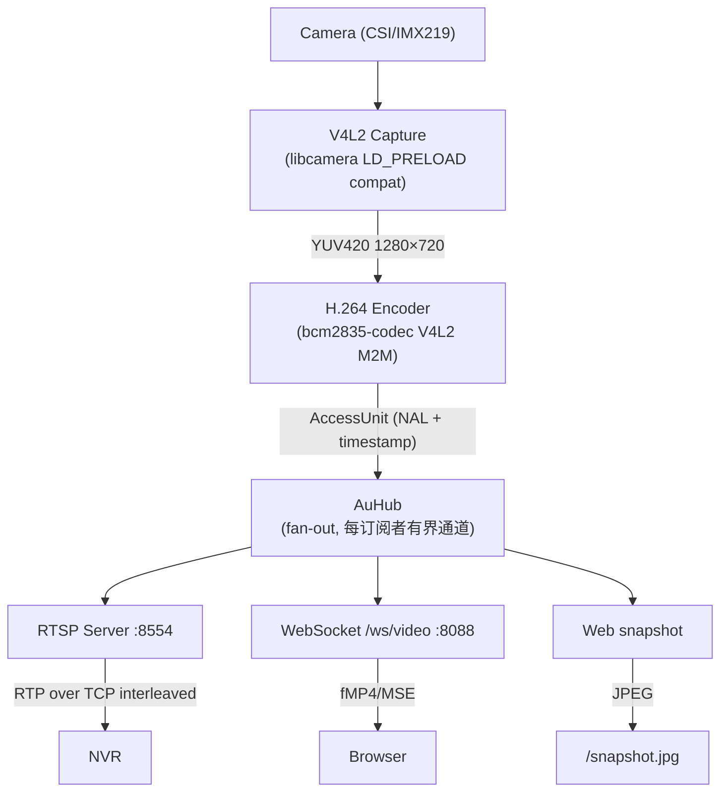

# NVR Integration & Streaming Debugging Notes

> 工程验证笔记：记录与 gortsplib 系 NVR 互操作中踩过的每一个问题、
> 根因与修复，供后续排障参考。验证命令中的地址均为示例。

Real-world debugging experience from integrating a Raspberry Pi 3B camera
service with a MiBee NVR (gortsplib-based). Documents every issue found,
root cause, and fix — as a reference for future troubleshooting.

---

## Architecture Overview



### Key Design Decisions

| Decision | Rationale |
|----------|-----------|
| AuHub capacity = 64 (RTSP), 2 (WebSocket) | RTSP needs buffer tolerance; WebSocket needs low latency |
| force_keyframe every i_period | bcm2835-codec ignores V4L2 i_period control; must force manually |
| Atomic frame writes (TCP interleaved) | Prevents partial P-frame delivery causing decoder corruption |
| CPU throttle detection + frame skip | Pi 3B under-voltage causes encoder corruption; skip frames to recover |

---

## Issues Found and Fixed

### 1. WS-Discovery "Address already in use" on restart

**Symptom**: Discovery server fails to bind port 3702 after service restart.

**Root cause**: Duplicate `StdUdpSocket::bind("0.0.0.0:3702")` call in
`discovery.rs` — second bind shadowed the first, always failing.

**Fix**: Removed duplicate bind; added `socket2` crate with `SO_REUSEADDR`
before binding.

**File**: `src/onvif/discovery.rs`

---

### 2. RTSP DESCRIBE returns empty SDP (NVR can't connect)

**Symptom**: NVR reports "invalid SDP: no media streams present in SDP".

**Root cause**: `send_response()` auto-adds `Content-Length` header, but
`handle_describe()` ALSO passed it manually → **duplicate Content-Length
headers**. Strict NVR parsers reject the response entirely.

**Fix**: Removed manual `Content-Length` from DESCRIBE handler. Also added
trailing `\r\n` to SDP body (RFC 4566 requirement).

**File**: `src/streaming/rtsp.rs`

---

### 3. NVR video freezes after a few seconds (RTP seq gaps)

**Symptom**: NVR reports ~500 "RTP packet is missing" errors per 10 minutes.

**Root cause**: `access_unit_to_frames()` pre-allocates RTP sequence numbers
via `fetch_add()` for ALL packets in an access unit. When the TCP write
times out mid-frame, remaining packets are skipped but their seq numbers
are already consumed → **gaps in sequence**.

**Fix**: After each AU send attempt, rewind `session.seq` to
`last_sent_seq + 1` (or `seq_before` if nothing was sent).

**File**: `src/streaming/rtsp.rs`

---

### 4. H.264 macroblock corruption (3402 errors per frame)

**Symptom**: `ffmpeg -rtsp_transport tcp` shows "concealing 3402 DC, 3402 AC,
3402 MV errors in P frame". Even I-frames corrupted.

**Root causes** (multiple, fixed in sequence):

#### 4a. P-frames sent before first keyframe

New PLAY sessions received P-frames immediately, before any IDR. The
decoder has no reference frame → all P-frames corrupt.

**Fix**: Added `sent_keyframe` flag — skip all frames until the first
keyframe arrives, then start sending.

#### 4b. Partial P-frame delivery

TCP interleaved mode sent RTP packets one by one. If a write timed out
mid-frame, the client received partial FU-A fragments → incomplete NAL →
decoder corruption.

**Fix**: Combine all RTP packets for one AU into a single `write_all()`
call. Either the entire frame is written or nothing.

#### 4c. P-frames referencing dropped frames

When a P-frame write timed out, subsequent P-frames still referenced the
dropped frame's data. Even though those P-frames were delivered
successfully, the decoder couldn't reconstruct them.

**Fix**: Set `pframe_dropped = true` after any P-frame timeout. Skip all
subsequent P-frames until the next keyframe resets the flag.

**File**: `src/streaming/rtsp.rs`

---

### 5. DTS timestamp duplication ("non monotonically increasing dts")

**Symptom**: ffmpeg reports "Application provided invalid, non monotonically
increasing dts to muxer in stream 0: 48 >= 48".

**Root causes** (multiple):

#### 5a. Timestamp computed at send time, not capture time

`access_unit_to_frames()` used `Instant::now()` to compute the RTP
timestamp. When multiple frames were processed in a burst (from the
encoder's output buffer), they all got similar timestamps.

**Fix**: Use `au.timestamp` (actual frame capture time) instead.

#### 5b. Shadow variable overwrote monotonic guard

After adding monotonic timestamp logic (`fetch_max` + `prev + 3000`), an
old line `let timestamp = (elapsed.as_secs_f64() * 90000.0) as u32;`
remained and **shadowed** the correctly computed value.

**Fix**: Removed the shadowing line.

#### 5c. Frames produced in bursts with identical timestamps

The camera sometimes produces frames in rapid bursts (2-3 frames within
1ms). Even with capture-time timestamps, these get near-identical RTP
timestamps.

**Fix**: Added `AtomicU32 last_ts` to `Session`. Compute timestamp as
`max(computed, prev + 3000)` — minimum 3000-tick increment (one frame at
30fps / 90kHz) between consecutive frames.

**File**: `src/streaming/rtsp.rs`

---

### 6. Pi 3B under-voltage throttling → intermittent encoder corruption

**Symptom**: Stream is clean for several seconds, then a burst of corrupt
frames, then clean again. Pattern repeats every few seconds.

**Diagnosis**: `vcgencmd get_throttled` returns `0x50005`:
- Bit 0: under-voltage detected NOW
- Bit 2: ARM frequency capped NOW
- Bit 16: under-voltage has occurred
- Bit 18: frequency cap has occurred

**Root cause**: The old Pi 3B board has chronic power delivery issues.
When the GPU/H.264 encoder is under load, voltage drops → firmware caps
frequency → encoder produces corrupt frames during the transition.

**Fix**: Added CPU throttle detection in the encoder thread:
- Read `/sys/devices/platform/soc:firmware/get_throttled` (firmware state)
- Fallback to `/sys/devices/system/cpu/cpu0/cpufreq/scaling_cur_freq`
- When throttled (< 1GHz), skip every other frame to halve encoder load
- Self-correcting: throttle → skip frames → load drops → frequency recovers

**Result**: After implementation, CPU stabilized at 1.2GHz, 60-second test
showed 0 errors.

**File**: `src/camera/v4l2.rs`

---

### 7. Web preview black screen (MJPEG incompatible with Chrome 120+)

**Symptom**: Web preview area shows black. `img.naturalWidth = 0`.

**Root cause**: Chrome 120+ doesn't render `multipart/x-mixed-replace`
streams in `` elements.

**Fix**: Replaced MJPEG with H.264 over WebSocket + MSE (Media Source
Extensions). Server sends fMP4 init segment + media fragments; browser
decodes H.264 via `<video>` element.

**Files**: `src/web/fmp4.rs` (new), `src/web/video_ws.rs` (new),
`static/app.js`, `static/index.html`

---

### 8. Web preview latency (3-9 seconds)

**Symptom**: Camera movement takes 3-9 seconds to appear in web preview.

**Root cause**: Multiple layers of buffering:
- AuHub subscriber capacity = 64 frames (4.3s at 15fps)
- WebSocket bridge = 32 frames (2.1s)
- MSE SourceBuffer accumulation without live-edge seeking

**Fix**:
- Server: AuHub capacity = 2 for WebSocket, bridge drains to latest frame
- Client: Playback rate catch-up (1.0-1.5x when >0.5s behind), hard seek
  to live edge when >2s behind, buffer trimming (keep ~1s), frame dropping

**Result**: Latency reduced to <1 second.

**Files**: `src/h264/hub.rs`, `src/web/video_ws.rs`, `static/app.js`

---

### 9. RTSP TCP interleaved write deadlock

**Symptom**: NVR connects but video freezes. Send-Q grows to 1.3MB.
Server can't process RTSP commands (GET_PARAMETER keepalive).

**Root cause**: `writer.write_all(frame).await` blocks forever when the
NVR stops reading. Since the same `writer` handles RTSP responses, no
commands can be processed → deadlock.

**Fix**: Adaptive write timeout:
- Keyframes: 5 seconds (must deliver)
- P-frames: 2 seconds (can drop)
- 5 consecutive keyframe timeouts → close connection (forces NVR reconnect)

**File**: `src/streaming/rtsp.rs`

---

### 10. No periodic keyframes (infinite GOP)

**Symptom**: Only one keyframe at service start. NVR can't recover from
any frame loss.

**Root cause**: bcm2835-codec encoder ignores the `V4L2_CID_MPEG_VIDEO_H264_I_PERIOD`
control (shiguredo_v4l2 sets it but the ioctl fails silently). Default
GOP = 60, but the encoder produces only the initial IDR.

**Fix**: Call `encoder.encode(..., force_kf=true)` every `i_period` frames
via shiguredo's `force_keyframe` parameter. Uses
`V4L2_CID_MPEG_VIDEO_FORCE_KEY_FRAME` button control.

**File**: `src/camera/v4l2.rs`

---

## Configuration for Stable Streaming on Pi 3B

```toml
[camera]
width = 1280
height = 720
fps = 10
bitrate = 1000000  # 1 Mbps (2 Mbps triggers throttling on old Pi 3B)
```

### Why these values

| Setting | Value | Rationale |
|---------|-------|-----------|
| Bitrate | 1 Mbps | 2 Mbps overloads encoder → throttling → corruption |
| FPS | 10 | Reduces encoder load; camera still captures at native rate |
| Resolution | 1280×720 | Good quality/performance balance for Pi 3B |

---

## fMP4 Muxer Implementation Notes

The fMP4 muxer (`src/web/fmp4.rs`) builds ISO BMFF fragments manually
(no external MP4 crate dependency):

### Init Segment Structure
```
ftyp (major: iso5, compatible: iso5, avc1, mp42)
moov
  mvhd (timescale: 90000)
  trak
    tkhd (track_id: 1)
    mdia
      mdhd (timescale: 90000)
      hdlr (handler: vide)
      minf
        vmhd
        dinf → dref (self-contained url)
        stbl
          stsd → avc1 → avcC (SPS/PPS from encoder)
          stts, stsc, stsz, stco (empty — data in moof)
  mvex → trex (signals fragmented MP4)
```

### Media Segment Structure
```
moof
  mfhd (sequence number)
  traf
    tfhd (default-base-is-moof flag)
    tfdt (version 1, 64-bit base decode time)
    trun (sample count, data offset, duration, size, flags)
mdat (AVCC-formatted NAL units, 4-byte length prefix)
```

### Key Implementation Details

- **mvex box required**: Without it, Chrome rejects the init segment
  ("Detected unfragmented MP4")
- **avcC box**: Profile/level extracted from SPS bytes [1..3] for codec
  string (e.g., `avc1.640028`)
- **AUD NALUs (type 9)**: Stripped from media segments (not needed in AVCC)
- **data_offset**: Pre-computed as moof_size + 8 (mdat header)

---

## Verification Commands

### RTSP stream health (from any machine)
```bash
# 12-second decode test — should show 0 errors
timeout 12 ffmpeg -rtsp_transport tcp -i rtsp://192.168.1.100:8554/stream -f null - 2>&1 | grep -cE "conceal|dts|corrupt"

# Quick SDP check
python3 -c "
import socket; s=socket.socket(); s.connect(('192.168.1.100',8554))
s.sendall(b'DESCRIBE rtsp://192.168.1.100:8554/stream RTSP/1.0\r\nCSeq: 1\r\n\r\n')
import time; time.sleep(1); print(s.recv(4096).decode()[:300])
"
```

### Pi health
```bash
ssh pi@192.168.1.100 'vcgencmd get_throttled && vcgencmd measure_temp && cat /sys/devices/system/cpu/cpu0/cpufreq/scaling_cur_freq'
# throttled=0x0 = healthy; 0x50005 = under-voltage + freq capped
```

### ONVIF discovery
```bash
# Should return ProbeMatches
python3 -c "
import socket; s=socket.socket(socket.AF_INET,socket.SOCK_DGRAM)
s.settimeout(2); s.setsockopt(socket.IPPROTO_IP,socket.IP_MULTICAST_TTL,2)
s.sendto(b'<Probe/>',('239.255.255.250',3702))
print(len(s.recvfrom(8192)[0]),'bytes response')
"
```

### Web preview
```bash
# WebSocket video endpoint
curl -s -o /dev/null -w '%{http_code}' http://192.168.1.100:8088/
# Should return 200
```

---

## Key Lessons

1. **Duplicate Content-Length kills strict parsers** — RTSP/HTTP parsers
   in NVR libraries (gortsplib) are stricter than ffmpeg.

2. **Never send P-frames without a preceding IDR** — the decoder has no
   reference and produces garbage. Always wait for the first keyframe.

3. **Atomic frame delivery matters** — partial P-frame data is worse than
   no data. The decoder can recover from a missing frame (with artifacts)
   but not from a corrupted partial frame.

4. **RTP timestamps must be strictly monotonic** — even 1-tick duplication
   causes "non monotonically increasing DTS" errors. Use atomic counters
   with minimum increment guarantees.

5. **Pi 3B throttling is real and corrupts H.264 output** — under-voltage
   causes the GPU to drop frequency mid-encode, producing corrupt NALUs.
   Software mitigation (frame skipping + reduced bitrate) is effective.

6. **Chrome dropped MJPEG `` support** — use WebSocket + MSE for
   H.264 video in the browser. MJPEG snapshot polling is a fallback.
